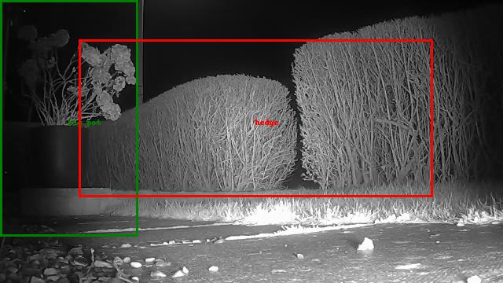
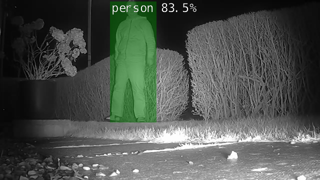

# CudaCam

Inspired by  https://github.com/dusty-nv/jetson-inference/ 

Did this as a lockdown project.

The neighbourhood cats, dogs and other more interesting wildlife are now more transparent.

CudaCam runs on a Nvidia Jetson Nano giving your home or small office a bespoke meaningfully-filtered AI camera event generator on a budget.

Can record all incoming video as well in case something goes down.

Uses a very network efficient [RTSP proxy](https://github.com/aler9/rtsp-simple-server) so that you can do the above and also live monitoring with something like [VLC media player](https://www.videolan.org/vlc/index.en-GB.html).


You will need some basic Linux skills and a bit of time looking at initial application output to prune false positives by adjusting these sections in the [configuration file](./config.txt):

1. **[label_alarmlist]** sets what events (a list of possibilities is [here](./ssd_coco_labels.txt)) need alarmed above the given confidence threshold. Examine your logfiles and/or database to see what is coming in.

2. **[label_percent_screenfill_min]** states that a given event should only be considered if its percetage image area size is bigger than that given. I put this option in as certain types of leaves in the garden had the AI saying all sorts.

3. **[label_mutelist]** says that you are not interested in those things (e.g. tennis rackets) period. Be prudent though, my favourite cat is often labelled as a bear, and not-so favourite cat a cow!

4. **[object_mutelist-]** defines per camera areas where events are muted:

	**_inside-cameraname** (mute all events inside a defined area) : use for small things that repeatably generate false positives. For me that was a potted plant out front which AI said was a person at night.

	**_outside-cameraname** (mute all events outside, but also encapsulating, a defined area) : use for large things that do the same. For me, my front hedge became a dog as the sun began to set!



## Example alarmed event



You also get an email and/or MQTT message for these if [smtp] and/or [mqtt] is configured in the [configuration file](./config.txt). If you do not use, just delete those sections.

[Samba](https://www.samba.org/) is useful if you want to access events, images and video folders on the Jetson from a PC, but I tend to use [WinSCP](https://winscp.net/eng/index.php).

## Important note

The first time CudaCam is run using start.sh in step 4. below, it will take five minutes or more for the AI model running on the GPU to be initially compiled.
 
After that on subsequent runs it will only take about thirty seconds to load from a cache.

Be patient!

## Installing and running

Note that the script ./configure.py below creates **start.sh** and does other configuration work as well. You will need to re-run if cameras are added and/or image/video folders deleted.

1. Put your camera URIs and image / video storage pathnames in the [configuration file](./config.txt), then:

```console
bash ./install-depends.sh

python3 ./configure.py ./config.txt

bash ./start.sh
```

2. Examine the images folder / logfiles or sqlite database then tune the [configuration file](./config.txt) to remove any false positives you get.

3. Then use this to start and stop CudaCam:

```console
./start.sh

./stop.sh
```

3. If you delete an image or video folder, or add or delete a camera, things will need reconfigured again:
```console
python3 ./configure.py ./config.txt
```

4. The default values in rtsp-simple-server.yml worked OK for me with 3 SD cameras. 

However upping the camera resolution and framerate caused the proxy to run out of steam (got blank cameras sometimes when live monitoring).
To test a fix for that, I changed these in rtsp-simple-server/rtsp-simple-server.yml 
To make that change permanent, you need to change rtsp-simple-server/rtsp-simple-server.yml.original as well.

```console
readBufferCount: 512 ->	readBufferCount: 2048 
protocols: [udp, tcp] -> protocols: [tcp]
```

All now seems OK.

## Basic operational outline

```python
For all cameras
	Get a frame
		Has any motion been detected in that frame ?
			Are there any unfiltered AI detection events in that frame ?
				Does any event in this frame meet any given alarm criteria ?
					Alarm (MQTT and SMTP email - as configured or not)
```

## Performance and power plans

Four cameras attached at 720p, 20fps - Constant Bit Rate. Ambient temperature was 15C. No cooling. ai_resize_factor = 0.5.

Measured using [jtop](https://pypi.org/project/jetson-stats/).

| Power plan mode |    Current   | AO temp (C)  | Images per second |
| :-------------: | :----------: | :-----------:| :-----------------|
|       1         |     2.5A     |      52      |         190       |
|       0         |     6.0A     |      66      |         310       |   
	
To change power plan mode on the Jetson Nano (and survive a reboot): 

```console
sudo nano /etc/nvpmodel.conf
```

*change PM_CONFIG DEFAULT at bottom of that file to **1** - **low** power or **0** - **high** power*

then

```console
rm /var/lib/nvpmodel/status
sudo reboot
```

## Example startup logfile
```bash
2021-03-08:19:19:43,355 INFO     [CudaCam.py:463] CudaCam started
2021-03-08:19:19:43,356 INFO     [CudaCam.py:469] Remapped rtsp://192.168.1.10:554/user=admin&password=secret&channel=1&stream=0.sdp to rtsp://127.0.0.1:8554/front_garden as using_rtsp_simple_proxy set
2021-03-08:19:19:43,356 INFO     [CudaCam.py:469] Remapped rtsp://192.168.1.12:554/user=admin&password=secret&channel=1&stream=0.sdp to rtsp://127.0.0.1:8554/back_garden as using_rtsp_simple_proxy set
2021-03-08:19:19:43,357 INFO     [CudaCam.py:469] Remapped rtsp://192.168.1.11:554/user=admin&password=secret&channel=1&stream=0.sdp to rtsp://127.0.0.1:8554/back_patio as using_rtsp_simple_proxy set
2021-03-08:19:19:46,892 INFO     [CudaCam.py:480] Starting inference engine, can take a while
2021-03-08:19:20:03,587 INFO     [CudaCam.py:482] Inference engine is up
2021-03-08:19:20:03,733 INFO     [CudaCam.py:517] Starting cameras and getting test images for /media/nano1/usbhdd/mutelist_reminder, can take a while
2021-03-08:19:20:14,936 INFO     [CudaCam.py:571] Processed 0 images in the past 10 seconds
2021-03-08:19:20:25,089 INFO     [CudaCam.py:571] Processed 320 images in the past 10 seconds
2021-03-08:19:21:22,700 INFO     [CudaCam.py:657] Event 'Initialised' : front_garden - person, confidence 0.54 : 211,286,13,247
2021-03-08:19:21:25,760 INFO     [CudaCam.py:657] Event 'Has moved' : front_garden - person, confidence 0.84 : 220,314,3,245
2021-03-08:19:21:25,969 INFO     [CudaCam.py:571] Processed 302 images in the past 10 seconds
```

## Contributing
Have moved on to the next thing, so will shortly archive.

Please do email JoeTester1965 at mail dot com with any questions.

## License
[MIT](https://choosealicense.com/licenses/mit/)
